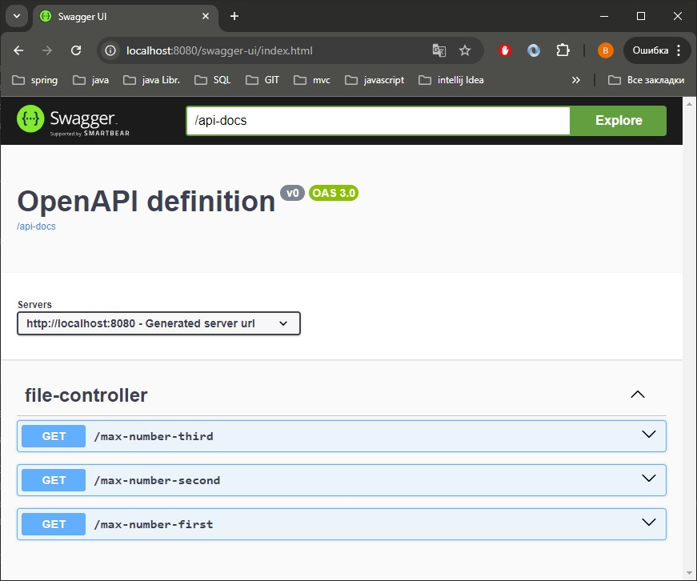
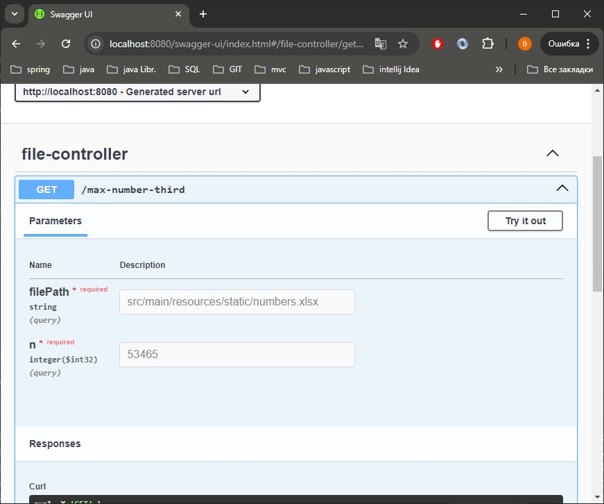

# Создаем новый проект SpringBoot
[Переходим в Spring Initializr](https://start.spring.io/)

Выбераем следующие параметры:  
* Project: Maven Project
* Language: Java
* Spring Boot: 3.3.4

 Project Metadata:

* Group: by.bogin
* Artifact: max_number
* Name: max_number
* Description: Service for finding max number
* Package name: by.bogin.max_number
* Packaging: Jar
* Java: 17

Скачиваем проект.

# Добавление зависимостейв ваш pom.xml файл:
`<dependencies>`  

    <dependency> 
    <groupId>org.springframework.boot</groupId>  
    <artifactId>spring-boot-starter-web</artifactId>  
    </dependency>`  

    <dependency>  
    <groupId>org.apache.poi</groupId>  
    <artifactId>poi-ooxml</artifactId>  
    <version>5.3.0</version>  
    </dependency>  

    <dependency>  
    <groupId>org.springdoc</groupId>  
    <artifactId>springdoc-openapi-starter-webmvc-ui</artifactId>  
    <version>2.6.0</version>  
    </dependency>  

`</dependencies>`

# Конфигурируем Swagger(добавляем в application.properties):
springdoc.api-docs.path=/api-docs  
springdoc.swagger-ui.path=/swagger-ui
# [GIT repository max_number](https://github.com/boginav/max_number/archive/refs/heads/master.zip):
# [Скачиваем zip-файл с git в среде разработки](https://github.com/boginav/max_number/archive/refs/heads/master.zip):
Разархивируем zip.  
Открываем в среде разработки.  
Запускаем. Переходим по адресу (http://localhost:8080/swagger-ui).
# Или устанавливаем jar:
Перейдите в каталог, где находится ваш JAR-файл: cd /path/jar.  
Запустите JAR-файл с помощью команды: java -jar max_number-0.0.1-SNAPSHOT.jar  
Запускаем. Переходим по адресу (http://localhost:8080/swagger-ui).    

 Можно запустить jar в контейнере Docker, но исходные данные не оговаривались.

# Тестировани:
  

С использованием PriorityQueue /max-number-first   
С использованием LinkedList /max-number-second  
Используется собственный двусвязный список DoubleLinkedList /max-number-third

  

В поле filePath введите src/main/resources/static/numbers.xlsx (ссылка на тестовый файл в проекте).
Или любой абсолютный путь на машине, которой запущен сервис.
В поле n введите номер числа.
